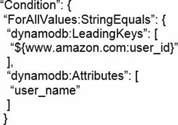
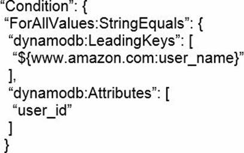
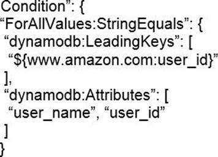
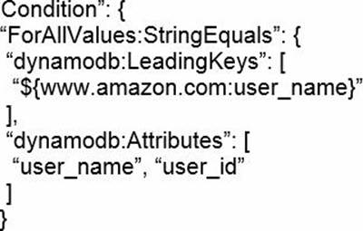
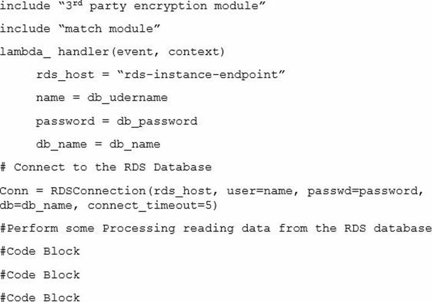

### Practice Exam 1
##### lines: 497-958

1. Which of the following are good use cases for how Amazon ElastiCache can help an application? (Select TWO)
	- Improve the performance of S3 PUT operations.
	- Improve the latency of deployments performed by AWS CodeDeploy.
	- Improve latency and throughput for read-heavy application workloads.
	- Reduce the time required to merge AWS CodeCommit branches.
	- Improve performance of compute-intensive applications.

    

Answer

      Correct answer: C, E
    

2. Which of the following services are key/value stores? (Choose 3 answers)
    - Amazon ElastiCache.
    - Simple Notification Service.
    - DynamoDB.
    - Simple Workflow Service.
    - Simple Storage Service.

    

Answer

      Correct answer: A, C, E
    

3. A developer wants to send multi-value headers to an AWS Lambda function that is registered as a target with an Application Load Balancer (ALB). What should the developer do to achieve this?
    - Place the Lambda function and target group in the same account.
    - Send the request body to the Lambda function with a size less than 1 MB 0.
    - Include the Base64 encoding status status code, status description, and headers in the Lambda function.
    - Enable the multi-value headers on the ALB.

    

Answer

      Correct answer: D
    

4. A company's ecommerce website is experiencing massive traffic spikes, which are causing performance problems in the company database. Users are reporting that accessing the website takes a long time. A developer wants to implement a caching layer using Amazon ElastiCache. The website is required to be responsive no matter which product a user views, and the updates to product information and prices must be strongly consistent. Which cache writing policy will satisfy these requirements?
    - Write to the cache directly and sync the backend at a later time.
    - Write to the backend first and wait for the cache to expire.
    - Write to the cache and the backend at the same time.
    - Write to the backend first and invalidate the cache.

    

Answer

      Correct answer: D
    

5. A Developer wants to upload data to Amazon S3 and must encrypt the data in transit. Which of the following solutions will accomplish this task? (Choose TWO)
    - Set up hardware VPN tunnels to a VPC and access S3 through a VPC endpoint.
    - Set up Client-Side Encryption with an AWS KMS-Managed Customer Master Key.
    - Set up Server-Side Encryption with AWS KMS-Managed Keys.
    - Transfer the data over an SSL connectionSet up Server-Side Encryption with S3-Managed Keys.
    - Set up Server-Side Encryption with S3-Managed Keys.

    

Answer

      Correct answer: B, D
    

6. A Developer wants to encrypt new objects that are being uploaded to an Amazon S3 bucket by an application. There must be an audit trail of who has used the key during this process. There should be no change to the performance of the application. Which type of encryption meets these requirements?
    - Server-side encryption using S3-managed keys.
    - Server-side encryption with AWS KMS-managed keys.
    - Client-side encryption with a client-side symmetric master key.
    - Client-side encryption with AWS KMS-managed keys.

    

Answer

      Correct answer: B
    

7. An application is being developed to audit several AWS accounts. The application will run in Account A and must access AWS services in Accounts B and C. What is the MOST secure way to allow the application to call AWS services in each audited account?
    - Configure cross-account roles in each audited account. Write code in Account A that assumes those roles.
    - Use S3 cross-region replication to communicate among accounts, with Amazon S3 event notifications to trigger Lambda functions.
    - Deploy an application in each audited account with its own role. Have Account A authenticate with the application.
    - Create an IAM user with an access key in each audited account. Write code in Account A that uses those access keys.

    

Answer

      Correct answer: A
    

8. A company uses a third-party tool to build, bundle, and package rts applications on-premises and store them locally. The company uses Amazon EC2 instances to run its front-end applications. How can an application be deployed from the source control system onto the EC2 instances?
    - Use AWS CodeDeploy and point it to the local storage to directly deploy a bundle m a zip. tar. or tar.gz format.
    - Upload the bundle to an Amazon S3 bucket and specify the S3 location when doing a deployment using AWS CodeDeploy.
    - Create a repository using AWS CodeCommit to automatically trigger a deployment to the EC2 instances.
    - Use AWS CodeBuild to automatically deploy the latest build to the latest EC2 instances.

    

Answer

      Correct answer: B
    

9. A company is building a compute-intensive application that will run on a fleet of Amazon EC2 instances. The application uses attached Amazon EBS disks for storing data. The application will process sensitive information and all the data must be encrypted. What should a developer do to ensure the data is encrypted on disk without impacting performance?
    - Configure the Amazon EC2 instance fleet to use encrypted EBS volumes for storing data.
    - Add logic to write all data to an encrypted Amazon S3 bucket.
    - Add a custom encryption algorithm to the application that will encrypt and decrypt all data.
    - Create a new Amazon Machine Image (AMI) with an encrypted root volume and store the data to ephemeral disks.

    

Answer

      Correct answer: A
    

10. A global company has an application running on Amazon EC2 instances that serves image files from Amazon S3. User requests from the browser are causing high traffic, which results in degraded performance. Which optimization solution should a Developer implement to increase application performance?
    - Create multiple prefix in the S3 bucket to increase the request rate.
    - Create an Amazon ElastiCache cluster to cache and serve frequently accessed items.
    - Use Amazon CloudFront to serve the content of images stored in Amazon S3.
    - Submit a ticket to AWS support to request a rate limit increase for the S3 bucket.

    

Answer

      Correct answer: C
    

11. An AWS Lambda function generates a 3MB JSON file and then uploads it to an Amazon S3 bucket daily. The file contains sensitive information, so the Developer must ensure that it is encrypted before uploading to the bucket. Which of the following modifications should the Developer make to ensure that the data is encrypted before uploading it to the bucket?
    - Use the default AWS KMS customer master key for S3 in the Lambda function code.
    - Use the S3 managed key and call the GenerateDataKey API to encrypt the file.
    - Use the GenerateDataKey API, then use that data key to encrypt the file in the Lambda function code.
    - Use a custom KMS customer master key created for S3 in the Lambda function code.

    

Answer

      Correct answer: C
    

12. Company D is running their corporate website on Amazon S3 accessed from http://www.companyd.com. Their marketing team has published new web fonts to a separate S3 bucket accessed by the S3 endpoint https://s3-us-west-1.amazonaws.com/cdfonts. While testing the new web fonts, Company D recognized the web fonts are being blocked by the browser. What should Company D do to prevent the web fonts from being blocked by the browser?
    - Enable versioning on the cdfonts bucket for each web font.
    - Create a policy on the cdfonts bucket to enable access to everyone.
    - Add the Content-MD5 header to the request for webfonts in the cdfonts bucket from the website.
    - Configure the cdfonts bucket to allow cross-origin requests by creating a CORS configuration.

    

Answer

      Correct answer: D
    

13. A developer must extend an existing application that is based on the AWS Services Application Model (AWS SAM). The developer has used the AWS SAM CLI to create the project. The project contains different AWS Lambda functions. Which combination of commands must the developer use to redeploy the AWS SAM application? (Select TWO)
    - sam init.
    - sam validate.
    - sam build.
    - sam deploy.
    - sam publish.

    

Answer

      Correct answer: C, D
    

14. An application deployed on AWS Elastic Beanstalk experiences increased error rates during deployments of new application versions, resulting in service degradation for users. The Development team believes that this is because of the reduction in capacity during the deployment steps. The team would like to change the deployment policy configuration of the environment to an option that maintains full capacity during deployment while using the existing instances. Which deployment policy will meet these requirements while using the existing instances?
    - All at once.
    - Rolling.
    - Rolling with additional batch.
    - Immutable.

    

Answer

      Correct answer: C
    

15. A Developer is creating an application that needs to locate the public IPv4 address of the Amazon EC2 instance on which it runs. How can the application locate this information?
    - Get the instance metadata by retrieving http://169.254.169.254/latest/metadata/.
    - Get the instance user data by retrieving http://169.254.169.254/latest/userdata/.
    - Get the application to run IFCONFIG to get the public IP address.
    - Get the application to run IPCONFIG to get the public IP address.

    

Answer

      Correct answer: A
    

16. The development team is working on an API that will be served from Amazon API gateway. The API will be served from three environments: development, test, and production. The API Gateway is configured to use 237 GB of cache in all three stages. Which is the MOST cost-efficient deployment strategy?
    - Create a single API Gateway with all three stages.
    - Create three API Gateways, one for each stage in a single AWS account.
    - Create an API Gateway in three separate AWS accounts.
    - Enable the cache for development and test environments only when needed.

    

Answer

      Correct answer: D
    

17. A company is migrating its on-premises database to Amazon RDS for MySQL. The company has read-heavy workloads, and wants to make sure it re-factors its code to achieve optimum read performance for its queries. How can this objective be met?
    - Add database retries to effectively use RDS with vertical scaling.
    - Use RDS with multi-AZ deployment.
    - Add a connection string to use an RDS read replica for read queries.
    - Add a connection string to use a read replica on an EC2 instance.

    

Answer

      Correct answer: C
    

18. A developer needs to modify an application architecture to meet new functional requirements. Application data is stored in Amazon DynamoDB and processed for analysis in a nightly batch. The system analysts do not want to wait unit the next day to view the processed data and have asked to have it available in near-real time. Which application architect pattern would enables the data to be processed as it is received?
    - Event driven.
    - Client served driven.
    - Fan-out driven.
    - Schedule driven.

    

Answer

      Correct answer: A
    

19. A software company needs to make sure user-uploaded documents are securely stored in Amazon S3. The documents must be encrypted at rest in Amazon S3. The company does not want to manage the security infrastructure in-house, but the company still needs extra protection to ensure it has control over its encryption keys due to industry regulations. Which encryption strategy should a developer use to meet these requirements?
    - Server-side encryption with Amazon S3 managed keys (SSE-S3).
    - Server-side encryption with customer-provided encryption keys (SSE-C).
    - Server-side encryption with AWS KMS managed keys (SSE-KMS).
    - Client-side encryption.

    

Answer

      Correct answer: C
    

20. An application uses Amazon Kinesis Data Streams to ingest and process large streams of data records in real time. Amazon EC2 instances consume and process the data from the shards of the Kinesis data stream by using Amazon Kinesis Client Library (KCL). The application handles the failure scenarios and does not require standby workers. The application reports that a specific shard is receiving more data than expected. To adapt to the changes in the rate of data flow, the 'hot' shard is resharded. Assuming that the initial number of shards in the Kinesis data stream is 4, and after resharding the number of shards increased to 6, what is the maximum number of EC2 instances that can be deployed to process data from all the shards?
    - 12.
    - 6.
    - 4.
    - 1.

    

Answer

      Correct answer: B
    

21. A gaming company is developing a mobile game application for iOS® and Android® platforms. This mobile game securely stores user data locally on the device. The company wants to allow users to use multiple device for the game, which requires user data synchronization across device.Which service should be used to synchronize user data across devices without the need to create a backend application?
    - AWS Lambda.
    - Amazon S3.
    - Amazon DynamoDB.
    - Amazon Cognito.

    

Answer

      Correct answer: D
    

22. A Developer is making changes to a custom application that is currently using AWS Elastic Beanstalk. After the Developer completes the changes, what solutions will update the Elastic Beanstalk environment with the new application version? (Choose TWO)
    - Package the application code into a .zip file, and upload, then deploy the packaged application from the AWS Management Console.
    - Package the application code into a .tar file, create a new application version from the AWS Management Console, then update the environment by using AWS CLI.
    - Package the application code into a .tar file, and upload and deploy the packaged application from the AWS Management Console.
    - Package the application code into a .zip file, create a new application version from the packaged application by using AWS CLI, then update the environment by using AWS CLI.
    - Package the application code into a .zip file, create a new application version from the AWS Management Console, then rebuild the environment by using AWS CLI.

    

Answer

      Correct answer: A, D
    

23. A company is running an application built on AWS Lambda functions. One Lambda function has performance issues when it has to download a 50MB file from the Internet in every execution. This function is called multiple times a second. What solution would give the BEST performance increase?
    - Cache the file in the /tmp directory.
    - Increase the Lambda maximum execution time.
    - Put an Elastic Load Balancer in front of the Lambda function.
    - Cache the file in Amazon S3.

    

Answer

      Correct answer: A
    

24. Queries to an Amazon DynamoDB table are consuming a large amount of read capacity. The table has a significant number of large attributes. The application does not need all of the attribute data. How can DynamoDB costs be minimized while maximizing application performance?
    - Batch all the writes, and perform the write operations when no or few reads are being performed.
    - Create a global secondary index with a minimum set of projected attributes.
    - Implement exponential backoffs in the application.
    - Load balance the reads to the table using an Application Load Balancer.

    

Answer

      Correct answer: B
    

25. A Developer is writing a REST service that will add items to a shopping list. The service is built on Amazon API Gateway with AWS Lambda integrations. The shopping list items are send as query string parameters in the method request. How should the Developer convert the query string parameters to arguments for the Lambda function?
    - Enable request validation.
    - Include the Amazon Resource Name (ARN) of the Lambda function.
    - Change the integration type.
    - Create a mapping template.

    

Answer

      Correct answer: D
    

26. A development team is creating a new application designed to run on AWS. While the test and production environments will run on Amazon EC2 instances, developers will each run their own environment on their laptops. Which of the following is the simplest and MOST secure way to access AWS services from the local development machines?
    - Use an IAM role to assume a role and execute API calls using the role.
    - Create an IAM user to be shared with the entire development team, provide the development team with the access key.
    - Create an IAM user for each developer on the team: provide each developer with a unique access key.
    - Set up a federation through an Amazon Cognito user pool.

    

Answer

      Correct answer: B
    

27. How is provisioned throughput affected by the chosen consistency model when reading data from a DynamoDB table?
    - Strongly consistent reads use the same amount of throughput as eventually consistent reads.
    - Strongly consistent reads use more throughput than eventually consistent reads.
    - Strongly consistent reads use less throughput than eventually consistent reads.
    - Strongly consistent reads use variable throughput depending on read activity.

    

Answer

      Correct answer: B
    

28. A developer needs to deploy a new version to an AWS Elastic Beanstalk application. How can the developer accomplish this task?
    - Upload and deploy the new application version in the Elastic Beanstalk console.
    - Use the eb init CLI command to deploy a new version.
    - Terminate the current Elastic Beanstalk environment and create a new one.
    - Modify the ebextensions folder to add a source option to services.

    

Answer

      Correct answer: A
    

29. A gaming application stores scores for players in an Amazon DynamoDB table that has four attributes: user_id, user_name, user_score, and user_rank. The users are allowed to update their names only if a user is authenticated by web identity federation. Which set of conditions should be added in the policy attached to the role for the DynamoDB: PutItem API call?
    - Option A.
    
    - Option B.
    
    - Option C.
    
    - Option D.
    

    

Answer

      Correct answer: A
    

30. A developer wants the ability to roll back to a previous version of an AWS Lambda function in the event of errors caused by a new deployment. How can the developer achieve this with MINIMAL impact on users?
    - Change the application to use an alias that points to the current version. Deploy the new version of the code. Update the alias to use the newly deployed version. If too many errors are encountered, point the alias back to the previous version.
    - Change the application to use an alias that points to the current version. Deploy the new version of the code. Update the alias to direct 10% of users to the newly deployed version. If too many errors are encountered, send 100% of traffic to the previous version.
    - Do not make any changes to the application Deploy the new version of the code. If too many errors are encountered, point the application back to the previous version using the version number in the Amazon Resource Name (ARN).
    - Create three aliases: new, existing, and router. Point the existing alias to the current version. Have the router alias direct 100% of users to the existing alias. Update the application to use the router alias. Deploy the new version of the code. Point the new alias to this version. Update the router alias to direct 10% of users to the new alias. If too many errors are encountered, send 100% of traffic to the existing alias.

    

Answer

      Correct answer: B
    

31. An application contains two components: one component to handle HTTP requests, and another component to handle background processing tasks. Each component must scale independently. The developer wants to deploy this application using AWS Elastic Beanstalk. How should this application be deployed, based on these requirements?
    - Deploy the application in a single Elastic Beanstalk environment.
    - Deploy each component in a separate Elastic Beanstalk environment.
    - Use multiple Elastic Beanstalk environments for the HTTP component but one environment for the background task component.
    - Use multiple Elastic Beanstalk environments for the background task component but one environment for the HTTP component.

    

Answer

      Correct answer: B
    

32. A company is using AWS CloudFormation templates to deploy AWS resources. The company needs to update one of its AWS CloudFormation stacks. What can the company do to find out how the changes will impact the resources that are running?
    - Investigate the change sets.
    - Investigate the stack policies.
    - Investigate the Metadata section.
    - Investigate the Resources section.

    

Answer

      Correct answer: A
    

33. A developer is creating a serverless web application and maintains different branches of code. The developer wants to avoid updating the Amazon API Gateway target endpoint each time a new code push is performed. What solution would allow the developer to perform a code push efficiently, without the need to update the API Gateway?
    - Associate different AWS Lambda functions to an API Gateway target endpoint.
    - Create different stages in API Gateway, then associate API Gateway with aws Lambda.
    - Create aliases and versions In AWS Lambda.
    - Tag the AWS Lambda functions with different names.

    

Answer

      Correct answer: C
    

34. An application running on EC2 instances is storing data in an S3 bucket. Security policy mandates that all data must be encrypted in transit. How can the Developer ensure that all traffic to the S3 bucket is encrypted?
    - Install certificates on the EC2 instances.
    - Create a bucket policy that allows traffic where SecureTransport is true.
    - Create an HTTPS redirect on the EC2 instances.
    - Create a bucket policy that denies traffic where SecureTransport is false.

    

Answer

      Correct answer: B
    

35. A supplier is writing a new RESTful API for customers to query the status of orders. The customers requested the following API endpoint http://www.supplierdomain.com/status/customerID. Which of the following application designs meet the requirements? (Select TWO)
    - Amazon SQS; Amazon SNS.
    - Elastic Load Balancing; Amazon EC2.
    - Amazon ElastiCache; Amazon Elacticsearch Service.
    - Amazon API Gateway; AWS Lambda.
    - Amazon S3; Amazon CloudFront.

    

Answer

      Correct answer: B, D
    

36. A developer Is designing an AWS Lambda function that create temporary files that are less than 10 MB during execution. The temporary files will be accessed and modified multiple times during execution. The developer has no need to save or retrieve these files in the future. Where should the temporary file be stored?
    - the /tmp directory.
    - Amazon EFS.
    - Amazon EBS.
    - Amazon S3.

    

Answer

      Correct answer: A
    

37. A website's page load times are gradually increasing as more users access the system at the same time. Analysis indicates that a user profile is being loaded from a database in all the web pages being visited by each user and this is increasing the database load and the page load latency. To address this issue the Developer decides to cache the user profile data. Which caching strategy will address this situation MOST efficiently?
    - Create a new Amazon EC2 Instance and run a NoSQL database on it. Cache the profile data within this database using the write-through caching strategy.
    - Create an Amazon ElastiCache cluster to cache the user profile data. Use a cache-aside caching strategy.
    - Use a dedicated Amazon RDS instance for caching profile data. Use a write-through caching strategy.
    - Create an ElastiCache cluster to cache the user profile data. Use a write-through caching strategy.

    

Answer

      Correct answer: B
    

38. An advertising company has a dynamic website with heavy traffic. The company wants to migrate the website infrastructure to AWS to handle everything except website development. Which solution BEST meets these requirements?
    - Use AWS VM Import to migrate a web server image to AWS Launch the image on a compute-optimized Amazon EC2 instance.
    - Launch multiple Amazon Lightsail instance behind a load balancer. Set up the website on those instances.
    - Deploy the website code in an AWS Elastic Beanstalk environment. Use Auto Scaling to scale the numbers of instance.
    - Use Amazon S3 to host the website. Use Amazon CloudFornt to deliver the content at scale.

    

Answer

      Correct answer: C
    

39. A developer is writing an AWS Lambda function. The developer wants to log key events that occur during the Lambda function and include a unique identifier to associate the events with a specific function invocation. Which of the following will help the developer accomplish this objective?
    - Obtain the request identifier from the Lambda context object. Architect the application to write logs to the console.
    - Obtain the request identifier from the Lambda event object. Architect the application to write logs to a file.
    - Obtain the request identifier from the Lambda event object. Architect the application to write logs to the console.
    - Obtain the request identifier from the Lambda context object. Architect the application to write logs to a file.

    

Answer

      Correct answer: A
    

40. A company stores all personally identifiable information (PII) in an Amazon DynamoDB table named PII in Account A. An application running on Amazon EC2 instances in Account B requires access to the PII table. An administrators in Account A created an IAM role named AccessPII with privileges to access the PII table, and made account B a trusted entity. Which combination of actional steps should Developers take to access the table? (Select TWO)
    - Allow the EC2 IAM role the permission to assume the AccessPII role.
    - Allow the EC2 IAM role the permission to access the PII table.
    - Include the AWS API in the application code logic to obtain temporary credentials from the EC2 IAM role to access the PII table.
    - Include the AssumeRole API operation in the application code logic to obtain temporary credentials to access the PII table.
    - Include the GetSessionToken API operation in the application code logic to obtain temporary credentials to access the PII table.

    

Answer

      Correct answer: A, D
    

41. An AWS Lambda function accesses two Amazon DynamoDB tables. A developer wants to improve the performance of the Lambda function by identifying bottlenecks in the function. How can the developer inspect the timing of the DynamoDB API calls?
    - Add DynamoDB as an event source to the Lambda function. View the performance with Amazon CloudWatch metrics.
    - Place an Application Load Balancer (ALB) in front of the two DynamoDB tables. Inspect the ALB logs.
    - Limit Lambda to no more than five concurrent invocations Monitor from the Lambda console.
    - Enable AWS X-Ray tracing for the function. View the traces from the X-Ray service.

    

Answer

      Correct answer: D
    

42. An Amazon RDS database instance is used by many applications to look up historical data. The query rate is relatively constant. When the historical data is updated each day, the resulting write traffic slows the read query performance and affects all application users. What can be done to eliminate the performance impact on application users?
    - Make sure Amazon RDS is Multi-AZ so it can better absorb increased traffic.
    - Create an RDS Read Replica and direct all read traffic to the replica.
    - Implement Amazon ElastiCache in front of Amazon RDS to buffer the write traffic.
    - Use Amazon DynamoDB instead of Amazon RDS to buffer the read traffic.

    

Answer

      Correct answer: B
    

43. A company is developing a serverless ecommerce web application. The application needs to make coordinated, all-or-nothing changes to multiple items in the company's inventory table in Amazon DynamoDB. Which solution will meet these requirements?
    - Enable transactions for the DynamoDB table. Use the BatchWriteltem operation to update the items.
    - Use the TransactWriteitems operation to group the changes. Update the items in the table.
    - Set up a FIFO queue using Amazon SQS. Group the changes in the queue. Update the table based on the grouped changes.
    - Create a transaction table in an Amazon Aurora DB cluster to manage the transactions. Write a backend process to sync the Aurora DB table and the DynamoDB table.

    

Answer

      Correct answer: B
    

44. An application is running on an EC2 instance. The Developer wants to store an application metric in Amazon CloudWatch. What is the best practice for implementing this requirement?
    - Use the PUT Object API call to send data to an S3 bucket. Use an event notification to invoke a Lambda function to publish data to CloudWatch.
    - Publish the metric data to an Amazon Kinesis Stream using a PutRecord API call. Subscribe a Lambda function that publishes data to CloudWatch.
    - Use the CloudWatch PutMetricData API call to submit a custom metric to CloudWatch. Provide the required credentials to enable the API call.
    - Use the CloudWatch PutMetricData API call to submit a custom metric to CloudWatch. Launch the EC2 instance with the required IAM role to enable the API call.

    

Answer

      Correct answer: D
    

45. A Developer needs to design an application running on AWS that will be used to consume Amazon SQS messages that range from 1 KB up to 1GB in size. How should the Amazon SQS messages be managed?
    - Use Amazon S3 and the Amazon SQS CLI.
    - Use Amazon S3 and the Amazon SQS Extended Client Library for Java.
    - Use Amazon EBS and the Amazon SQS CLI.
    - Use Amazon EFS and the Amazon SQS CLI.

    

Answer

      Correct answer: B
    

46. A developer has written a multi-threaded application that is running on a fleet of Amazon EC2 instances. The operations team has requested a graphical method to monitor the number of running threads over time. What is the MOST efficient way to fulfill this request?
    - Periodically send the thread count to AWS X-Ray segments, then generate a service graph on demand.
    - Create a custom Amazon CloudWatch metric and periodically perform a PutMetricData call with the current thread count.
    - Periodically log thread count data to Amazon S3. Use Amazon Kinesis to process the data into a graph.
    - Periodically write the current thread count to a table using Amazon DynarnoDB and use Amazon CloudFront to create a graph.

    

Answer

      Correct answer: B
    

47. The Lambda function below is being called through an API using Amazon API Gateway. The average execution time for the Lambda function is about 1 second. The pseudocode for the Lambda function is as shown in the exhibit. What two actions can be taken to improve the performance of this Lambda function without increasing the cost of the solution? (Select TWO)
    
    - Package only the modules the Lambda function requires.
    - Use Amazon DynamoDB instead of Amazon RDS.
    - Move the initialization of the variable Amazon RDS connection outside of the handler function.
    - Implement custom database connection pooling with the Lambda function.
    - Implement local caching of Amazon RDS data so Lambda can re-use the cache.

    

Answer

      Correct answer: A, C
    

48. An application on AWS is using third-party APIs. The Developer needs to monitor API errors in the code, and wants to receive notifications if failures go above a set threshold value. How can the Developer achieve these requirements?
    - Publish a custom metric on Amazon CloudWatch and use Amazon Simple Email Service (SES) for notification.
    - Use an Amazon CloudWatch API-error metric and use Amazon Simple Notification Service (SNS) for notification.
    - Use an Amazon CloudWatch API-error metric and use Amazon SES for notification.
    - Publish a custom metric on Amazon CloudWatch and use Amazon SNS for notification.

    

Answer

      Correct answer: D
    

49. The release process workflow of an application requires a manual approval before the code is deployed into the production environment. What is the BEST way to achieve this using AWS CodePipeline?
    - Use multiple pipelines to allow approval.
    - Use an approval action in a stage.
    - Disable the stage transition to allow manual approval.
    - Disable a stage just prior the deployment stage.

    

Answer

      Correct answer: B
    

50. A Developer is asked to implement a caching layer in front of Amazon RDS. Cached content is expensive to regenerate in case of service failure. Which implementation below would work while maintaining maximum uptime?
    - Implement Amazon ElastiCache Redis in Cluster Mode.
    - Install Redis on an Amazon EC2 instance.
    - Implement Amazon ElastiCache Memcached.
    - Migrate the database to Amazon Redshift.

    

Answer

      Correct answer: A
    

