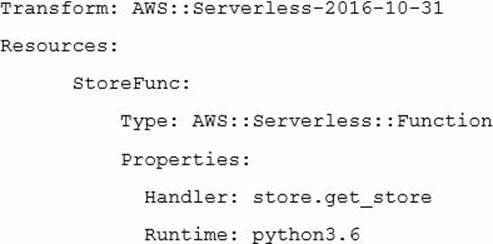
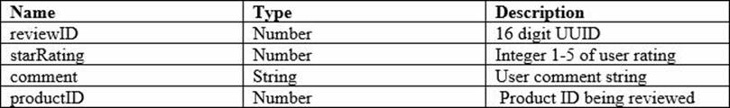
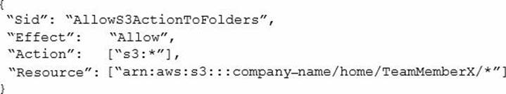
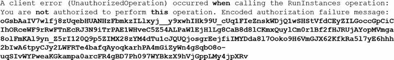

### Practice Exam 2
##### lines: 970 - 1436
Q1. A company has written a Java AWS Lambda function to be triggered whenever a user uploads an image to an Amazon S3 bucket. The function converts the original image to several different formats and then copies the resulting images to another Amazon S3 bucket. The Developers find that no images are being copied to the second Amazon S3 bucket. They have tested the code on an Amazon EC2 instance with 1GB of RAM, and it takes an average of 500 seconds to complete. What is the MOST likely cause of the problem?

- [ ] The Lambda function has insufficient memory and needs to be increased to 1 GB to match the Amazon EC2 instance.
- [ ] Files need to be copied to the same Amazon S3 bucket for processing, so the second bucket needs to be deleted.
- [x] Lambda functions have a maximum execution limit of 15 minutes, therefore the function is not completing.
- [ ] There is a problem with the Java runtime for Lambda, and the function needs to be converted to node.js.

    

Answer

      Correct answer: C
    

Q2. A web application is using Amazon Kinesis Streams for clickstream data that may not be consumed for up to 12 hours. How can the Developer implement encryption at rest for data within the Kinesis Streams?

- [ ] Enable SSL connections to Kinesis.
- [ ] Use Amazon Kinesis Consumer Library.
- [ ] Encrypt the data once it is at rest with a Lambda function.
- [x] Enable server-side encryption in Kinesis Streams.

    

Answer

      Correct answer: D
    

Q3. A Developer is creating a mobile application with a limited budget. The solution requires a scalable service that will enable customers to sign up and authenticate into the mobile application while using the organization's current SAML 2.0 identity provider. Which AWS service should be used to meet these requirements?

- [ ] AWS Lambda.
- [x] Amazon Cognito.
- [ ] AWS IAM.
- [ ] Amazon EC2.

    

Answer

      Correct answer: B
    

Q4. A company wants to migrate its web application to AWS and leverage Auto Scaling to handle peak workloads. The Solutions Architect determined that the best metric for an Auto Scaling event is the number of concurrent users. Based on this information, what should the Developer use to autoscale based on concurrent users?

- [ ] An Amazon SNS topic to be triggered when a concurrent user threshold is met.
- [ ] An Amazon Cloudwatch NetworkIn metric.
- [ ] Amazon CloudFront to leverage AWS Edge Locations.
- [x] A Custom Amazon CloudWatch metric for concurrent users.

    

Answer

      Correct answer: D
    

Q5. A Developer has written a serverless application using multiple AWS services. The business logic is written as a Lambda function which has dependencies on third-party libraries. The Lambda function endpoints will be exposed using Amazon API Gateway. The Lambda function will write the information to Amazon DynamoDB. The Developer is ready to deploy the application but must have the ability to rollback. How can this deployment be automated, based on these requirements?

- [ ] Deploy using Amazon Lambda API operations to create the Lambda function by providing a deployment package.
- [ ] Use an AWS CloudFormation template and use CloudFormation syntax to define the Lambda function resource in the template.
- [x] Use syntax conforming to the Serverless Application Model in the AWS CloudFormation template to define the Lambda function resource.
- [ ] Create a bash script which uses AWS CLI to package and deploy the application.

    

Answer

      Correct answer: C
    

Q6. A game stores user game data in an Amazon DynamoDB table. Individual users should not have access to other users' game data. How can this be accomplished?

- [ ] Encrypt the game data with individual user keys.
- [x] Restrict access to specific items based on certain primary key values.
- [ ] Stage data in SQS queues to inject metadata before accessing DynamoDB.
- [ ] Read records from DynamoDB and discard irrelevant data client-side.

    

Answer

      Correct answer: B
    

Q7. A Developer is creating a web application that requires authentication, but also needs to support guest access to provide users limited access without having to authenticate. What service can provide support for the application to allow guest access?

- [ ] IAM temporary credentials using AWS STS.
- [ ] Amazon Directory Service.
- [x] Amazon Cognito with unauthenticated access enabled.
- [ ] IAM with SAML integration

    

Answer

      Correct answer: C 
    

Q8. Given the source code for an AWS Lambda function in the local store.py containing a handler function called get_store and the following AWS CloudFormation template. What should be done to prepare the template so that it can be deployed using the AWS CLI command aws cloudformation deploy?

- [ ] Use AWS CloudFormation compile to base64 encode and embed the source file into a modified CloudFormation template.
- [x] Use AWS CloudFormation package to upload the source code to an Amazon S3 bucket and produce a modified CloudFormation template.
- [ ] Use AWS Lambda zip to package the source file together with the CloudFormation template and deploy the resulting zip archive.
- [ ] Use AWS Serverless create-package to embed the source file directly into the existing CloudFormation template.

    

Answer

      Correct answer: B
    

Q9. A Developer has created a large Lambda function, and deployment is failing with the following error:ClientError: An error occurred (InvalidParameterValueException) when calling the CreateFunction operation: Unzipped size must be smaller than XXXXXXXXX bytes', where XXXXXXXXX is the current Lambda limit. What can the Developer do to fix this problem?

- [ ] Submit a limit increase request to AWS Support to increase the function to the size needed.
- [ ] Use a compression algorithm that is more efficient than ZIP.
- [x] Break the function into multiple smaller Lambda functions.
- [ ] ZIP the ZIP file twice to compress it further.

    

Answer

      Correct answer: C
    

Q10. A serverless application uses an API Gateway and AWS Lambda. Where should the Lambda function store its session information across function calls?

- [x] In an Amazon DynamoDB table.
- [ ] In an Amazon SQS queue.
- [ ] In the local filesystem.
- [ ] In an SQLite session table using CDSQLITE_ENABLE_SESSION.

    

Answer

      Correct answer: A
    

Q11. An application reads data from an Amazon DynamoDB table. Several times a day, for a period of 15 seconds, the application receives multiple ProvisionedThroughputExceeded errors. How should this exception be handled?

- [ ] Create a new global secondary index for the table to help with the additional requests.
- [x] Retry the failed read requests with exponential backoff.
- [ ] Immediately retry the failed read requests.
- [ ] Use the DynamoDB 'UpdateItem' API to increase the provisioned throughput capacity of the table.

    

Answer

      Correct answer: B
    

Q12. A Developer is writing a Linux-based application to run on AWS Elastic Beanstalk. Application requirements state that the application must maintain full capacity during updates while minimizing cost. Which type of Elastic Beanstalk deployment policy should the Developer specify for the environment?

- [ ] Immutable.
- [ ] Rolling.
- [ ] All at Once.
- [x] Rolling with additional batch.

    

Answer

      Correct answer: D
    

Q13. When writing a Lambda function, what is the benefit of instantiating AWS clients outside the scope of the handler?

- [ ] Legibility and stylistic convention.
- [x] Taking advantage of connection re-use.
- [ ] Better error handling.
- [ ] Creating a new instance per invocation.

    

Answer

      Correct answer: B
    

Q14. A current architecture uses many Lambda functions invoking one another as large state machine. The coordination of this state machine is legacy custom code that breaks easily. Which AWS Service can help refactor and manage the state machine?

- [ ] AWS Data Pipeline.
- [ ] AWS SNS with AWS SQS.
- [ ] Amazon Elastic MapReduce.
- [x] AWS Step Functions.

    

Answer

      Correct answer: D
    

Q15. A company is developing a new online game that will run on top of Amazon ECS. Four distinct Amazon ECS services will be part of the architecture, each requiring specific permissions to various AWS services. The company wants to optimize the use of the underlying Amazon EC2 instances by bin packing the containers based on memory reservation. Which configuration would allow the Development team to meet these requirements MOST securely?

- [ ] Create a new Identity and Access Management (IAM) instance profile containing the required permissions for the various ECS services, then associate that instance role with the underlying EC2 instances.
- [ ] Create four distinct IAM roles, each containing the required permissions for the associated ECS service, then configure each ECS service to reference the associated IAM role.
- [ ] Create four distinct IAM roles, each containing the required permissions for the associated ECS service, then, create an IAM group and configure the ECS cluster to reference that group.
- [x] Create four distinct IAM roles, each containing the required permissions for the associated ECS service, then configure each ECS task definition to referenсe the associated IAM role.

    

Answer

      Correct answer: D
    

Q16. A Developer must re-implement the business logic for an order fulfilment system. The business logic has to make requests to multiple vendors to decide where to purchase an item. The whole process can take up to a week to complete. What is the MOST efficient and SIMPLEST way to implement a system that meets these requirements?

- [x] Use AWS Step Functions to execute parallel Lambda functions, and join the results.
- [ ] Create an AWS SQS for each vendor, poll the queue from a worker instance, and joint the results.
- [ ] Use AWS Lambda to asynchronously call a Lambda function for each vendor, and join the results.
- [ ] Use Amazon CloudWatch Events to orchestrate the Lambda functions.

    

Answer

      Correct answer: A
    

Q17. A Developer is receiving HTTP 400: ThrottlingException errors intermittently when calling the Amazon CloudWatch API. When a call fails, no data is retrieved. What best practice should first be applied to address this issue?

- [ ] Contact AWS Support for a limit increase.
- [ ] Use the AWS CLI to get the metrics.
- [ ] Analyze the applications and remove the API call.
- [x] Retry the call with exponential backoff.

    

Answer

      Correct answer: D
    

Q18. An application is real-time processing millions of events that are received through an API. What service could be used to allow multiple consumers to process the data concurrently and MOST cost-effectively?

- [ ] Amazon SNS with fanout to an SQS queue for each application.
- [ ] Amazon SNS with fanout to an SQS FIFO (first-in, first-out) queue for each application.
- [ ] Amazon Kinesis Firehouse.
- [x] Amazon Kinesis Streams.

    

Answer

      Correct answer: D
    

Q19. Where should the appspec.yml file be placed in order for AWS CodeDeploy to work?

- [x] In the root of the application source code directory structure.
- [ ] In the bin folder along with all the complied code.
- [ ] In an S3 bucket.
- [ ] In the same folder as the application configuration files.

    

Answer

      Correct answer: A
    

Q20. An application will ingest data at a very high throughput from many sources and must store the data in an Amazon S3 bucket. Which service would BEST accomplish this task?

- [x] Amazon Kinesis Firehose.
- [ ] Amazon S3 Acceleration Transfer.
- [ ] Amazon SQS.
- [ ] Amazon SNS.

    

Answer

      Correct answer: A
    

Q21. A Developer is creating a Lambda function and will be using external libraries that are not included in the standard Lambda libraries. What action would minimize the Lambda compute time consumed?

- [ ] Install the dependencies and external libraries at the beginning of the Lambda function.
- [ ] Create a Lambda deployment package that includes the external libraries.
- [ ] Copy the external libraries to Amazon S3, and reference the external libraries to the S3 location.
- [x] Install the external libraries in Lambda to be available to all Lambda functions.

    

Answer

      Correct answer: D
    

Q22. During non-peak hours, a Developer wants to minimize the execution time of a full Amazon DynamoDB table scan without affecting normal workloads. The workloads average half of the strongly consistent read capacity units during non-peak hours. How would the Developer optimize this scan?

- [x] Use parallel scans while limiting the rate.
- [ ] Use sequential scans.
- [ ] Increase read capacity units during the scan operation.
- [ ] Change consistency to eventually consistent during the scan operation.

    

Answer

      Correct answer: A
    

Q23. A large e-commerce site is being designed to deliver static objects from Amazon S3. The Amazon S3 bucket will server more than 300 GET requests per second. What should be done to optimize performance? (Choose TWO)

- [x] Integrate Amazon CloudFront with Amazon S3.
- [x] Enable Amazon S3 cross-region replication.
- [ ] Delete expired Amazon S3 server log files.
- [ ] Configure Amazon S3 lifecycle rules.Randomize Amazon S3 key name prefixes.
- [ ] Randomize Amazon S3 key name prefixes.

    

Answer

      Correct answer: A, B
    

Q24. A legacy service has an XML-based SOAP interface. The Developer wants to expose the functionality of the service to external clients with the Amazon API Gateway. Which technique will accomplish this?

- [x] Create a RESTful API with the API Gateway; transform the incoming JSON into a valid XML message for the SOAP interface using mapping templates.
- [ ] Create a RESTful API with the API Gateway; pass the incoming JSON to the SOAP interface through an Application Load Balancer.
- [ ] Create a RESTful API with the API Gateway; pass the incoming XML to the SOAP interface through an Application Load Balancer.
- [ ] Create a RESTful API with the API Gateway; transform the incoming XML into a valid message for the SOAP interface using mapping templates.

    

Answer

      Correct answer: A
    

Q25. A Developer has an application that can upload tens of thousands of objects per second to Amazon S3 in parallel within a single AWS account. As part of new requirements, data stored in S3 must use server side encryption with AWS KMS (SSE-KMS). After creating this change, performance of the application is slower. Which of the following is MOST likely the cause of the application latency?

- [ ] Amazon S3 throttles the rate at which uploaded objects can be encrypted using Customer Master Keys.
- [x] The AWS KMS API calls limit is less than needed to achieve the desired performance.
- [ ] The client encryption of the objects is using a poor algorithm.
- [ ] KMS requires that an alias be used to create an independent display name that can be mapped to a CM.

    

Answer

      Correct answer: B
    

Q26. A customer wants to deploy its source code on an AWS Elastic Beanstalk environment. The customer needs to perform deployment with minimal outage and should only use existing instances to retain application access log. What deployment policy would satisfy these requirements?

- [x] Rolling.
- [ ] All at once.
- [ ] Rolling with an additional batch.
- [ ] Immutable.

    

Answer

      Correct answer: A
    

Q27. A Developer has setup an Amazon Kinesis Stream with 4 shards to ingest a maximum of 2500 records per second. A Lambda function has been configured to process these records. In which order will these records be processed?

- [ ] Lambda will receive each record in the reverse order it was placed into the stream following a LIFO (last-in, first-out) method.
- [ ] Lambda will receive each record in the exact order it was placed into the stream following a FIFO (first­-in, first-out) method.
- [x] Lambda will receive each record in the exact order it was placed into the shard following a FIFO (first-in, first-out) method. There is no guarantee of order across shards.
- [ ] The Developer can select FIFO, (first-in, first-out), LIFO (last-in, last-out), random, or request specific record using the getRecords API.

    

Answer

      Correct answer: C
    

Q28. An organization must store thousands of sensitive audio and video files in an Amazon S3 bucket. Organizational security policies require that all data written to this bucket be encrypted. How can compliance with this policy be ensured?

- [ ] Use AWS Lambda to send notifications to the security team if unencrypted objects are pun in the bucket.
- [x] Configure an Amazon S3 bucket policy to prevent the upload of objects that do not contain the x-amz­-server-side-encryption header.
- [ ] Create an Amazon CloudWatch event rule to verify that all objects stored in the Amazon S3 bucket are encrypted.
- [ ] Configure an Amazon S3 bucket policy to prevent the upload of objects that contain the x-amz-server­side-encryption header.

    

Answer

      Correct answer: B
    

Q29. An application is designed to use Amazon SQS to manage messages from many independent senders. Each sender's messages must be processed in the order they are received. Which SQS feature should be implemented by the Developer?

- [ ] Configure each sender with a unique MessageGroupId.
- [ ] Enable MessageDeduplicationIds on the SQS queue.
- [x] Configure each message with unique MessageGroupIds.
- [ ] Enable ContentBasedDeduplication on the SQS queue.

    

Answer

      Correct answer: C
    

Q30. A Developer created a dashboard for an application using Amazon API Gateway, Amazon S3, AWS Lambda, and Amazon RDS. The Developer needs an authentication mechanism allowing a user to sign in and view the dashboard. It must be accessible from mobile applications, desktops, and tablets, and must remember user preferences across platforms. Which AWS service should the Developer use to support this authentication scenario?

- [ ] AWS KMS.
- [x] Amazon Cognito.
- [ ] AWS Directory Service.
- [ ] Amazon IAM.

    

Answer

      Correct answer: B
    

Q31. A Lambda function is packaged for deployment to multiple environments, including development, test, production, etc. Each environment has unique set of resources such as databases, etc. How can the Lambda function use the resources for the current environment?

- [ ] Apply tags to the Lambda functions.
- [ ] Hardcore resources in the source code.
- [x] Use environment variables for the Lambda functions.
- [ ] Use separate function for development and production.

    

Answer

      Correct answer: C
    

Q32. A Developer needs temporary access to resources in a second account. What is the MOST secure way to achieve this?

- [ ] Use the Amazon Cognito user pools to get short-lived credentials for the second account.
- [ ] Create a dedicated IAM access key for the second account, and send it by mail.
- [x] Create a cross-account access role, and use sts: AssumeRole API to get short-lived credentials.
- [ ] Establish trust, and add an SSH key for the second account to the IAM user.

    

Answer

      Correct answer: C
    

Q33. A Developer needs to use AWS X-Ray to monitor an application that is deployed on EC2 instances. What steps have to be executed to perform the monitoring?

- [ ] Deploy the X-Ray SDK with the application and use X-Ray annotation.
- [x] Install the X-Ray daemon and instrument the application code.
- [ ] Install the X-Ray daemon and configure it to forward data to Amazon CloudWatch Events.
- [ ] Deploy the X-Ray SDK with the application and instrument the application code.

    

Answer

      Correct answer: B
    

Q34. A Developer is creating an Auto Scaling group whose instances need to publish a custom metric to Amazon CloudWatch. Which method would be the MOST secure way to authenticate a CloudWatch PUT request?

- [ ] Create an IAM user with PutMetricData permission and put the user credentials in a private repository; have applications pull the credentials as needed.
- [ ] Create an IAM user with PutMetricData permission, and modify the Auto Scaling launch configuration to inject the user credentials into the instance user data.
- [ ] Modify the CloudWatch metric policies to allow the PutMetricData permission to instances from the Auto Scaling group.
- [x] Create an IAM role with PutMetricData permission and modify the Auto Scaling launching configuration to launch instances using that role.

    

Answer

      Correct answer: D
    

Q35. A Developer is working on an application that tracks hundreds of millions of product reviews in an Amazon DynamoDB table. The records include the data elements shown in the table. Which field, when used as the partition key, would result in the MOST consistent performance using DynamoDB?

- [ ] starRating.
- [x] reviewID.
- [ ] comment.
- [ ] productID.

    

Answer

      Correct answer: B
    

Q36. A development team consists of 10 team members. Similar to a home directory for each team member, the manager wants to grant access to user-specific folders in an Amazon S3 bucket. For the team member with the username 'TeamMemberX', the snippet of the IAM policy looks like this. Instead of creating distinct policies for each team member, what approach can be used to make this policy snippet generic for all team members?

- [x] Use IAM policy condition.
- [ ] Use IAM policy principal.
- [ ] Use IAM policy variables.
- [ ] Use IAM policy resource.

    

Answer

      Correct answer: A
    

Q37. A company needs to encrypt data at rest, but it wants to leverage an AWS managed service using its own master key. Which of the following AWS service can be used to meet these requirements?

- [ ] SSE with Amazon S3.
- [x] SSE with AWS KMS.
- [ ] Client-side encryption.
- [ ] AWS IAM roles and policies.

    

Answer

      Correct answer: B
    

Q38. A Developer has created a software package to be deployed on multiple EC2 instances using IAM roles. What actions could be performed to verify IAM access to get records from Amazon Kinesis Streams? (Select TWO)

- [ ] Use the AWS CLI to retrieve the IAM group.
- [ ] Query Amazon EC2 metadata for in-line IAM policies.
- [ ] Request a token from AWS STS, and perform a describe action.
- [x] Perform a get action using the '--dry-run' argument.
- [x] Validate the IAM role policy with the IAM policy simulator.

    

Answer

      Correct answer: D, E
    

Q39. A company wants to implement a continuous integration for its workloads on AWS. The company wants to trigger unit test in its pipeline for commits-on its code repository, and wants to be notified of failure events in the pipeline. How can these requirements be met?

- [x] Store the source code in AWS CodeCommit. Create a CodePipeline to automate unit testing. Use Amazon SNS to trigger notifications of failure events.
- [ ] Store the source code in GitHub. Create a CodePipeline to automate unit testing. Use Amazon SES to trigger notifications of failure events.
- [ ] Store the source code on GitHub. Create a CodePipeline to automate unit testing. Use Amazon CloudWatch to trigger notifications of failure events.
- [ ] Store the source code in AWS CodeCommit. Create a CodePipeline to automate unit testing. Use Amazon CloudWatch to trigger notification of failure events.

    

Answer

      Correct answer: A
    

Q40. An application takes 40 seconds to process instructions received in an Amazon SQS message. Assuming the SQS queue is configured with the default VisibilityTimeout value, what is the BEST way, upon receiving a message, to ensure that no other instances can retrieve a message that has already been processed or is currently being processed?

- [x] Use the ChangeMessageVisibility API to increase the VisibilityTimeout, then use the DeleteMessage API to delete the message.
- [ ] Use the DeleteMessage API call to delete the message from the queue, then call DeleteQueue API to remove the queue.
- [ ] Use the ChangeMessageVisibility API to decrease the timeout value, then use the DeleteMessage API to delete the message.
- [ ] Use the DeleteMessageVisibility API to cancel the VisibilityTimeout, then use the DeleteMessage API to delete the message.

    

Answer

      Correct answer: A
    

Q41. A Developer is developing an application that manages financial transactions. To improve security, multi-factor authentication (MFA) will be required as part of the login protocol. What services can the Developer use to meet these requirements?

- [ ] Amazon DynamoDB to store MFA session data, and Amazon SNS to send MFA codes.
- [x] Amazon Cognito with MFA.
- [ ] AWS Directory Service.
- [ ] AWS IAM with MFA enabled.

    

Answer

      Correct answer: B
    

Q42. A Developer is writing transactions into a DynamoDB table called 'SystemUpdates' that has 5 write capacity units. Which option has the highest read throughput?

- [ ] Eventually consistent reads of 5 read capacity units reading items that are 4 KB in size.
- [x] Strongly consistent reads of 5 read capacity units reading items that are 4 KB in size.
- [ ] Eventually consistent reads of 15 read capacity units reading items that are 1 KB in size.
- [ ] Strongly consistent reads of 15 read capacity units reading items that are 1 KB in size.

    

Answer

      Correct answer: B
    

Q43. A Developer has created an S3 bucket s3://mycoolapp and has enabled server across logging that points to the folder s3://mycoolapp/logs.The Developer moved 100 KB of Cascading Style Sheets (CSS) documents to the folder s3://mycoolapp/css, and then stopped work. When the developer came back a few days later, the bucket was 50 GB. What is the MOST likely cause of this situation?

- [ ] The CSS files were not compressed and S3 versioning was enabled.
- [ ] S3 replication was enabled on the bucket.
- [x] Logging into the same bucket caused exponential log growth.
- [ ] An S3 lifecycle policy has moved the entire CSS file to S3 Infrequent Access.

    

Answer

      Correct answer: C
    

Q44. A Developer is testing a Docker-based application that uses the AWS SDK to interact with Amazon DynamoDB. In the local development environment, the application has used IAM access keys. The application is now ready for deployment onto an ECS cluster. How should the application authenticate with AWS services in production?

- [x] Configure an ECS task IAM role for the application to use.
- [ ] Refactor the application to call AWS STS AssumeRole based on an instance role.
- [ ] Configure AWS access key/secret access key environment variables with new credentials.
- [ ] Configure the credentials file with a new access key/secret access key.

    

Answer

      Correct answer: A
    

Q45. A company is using AWS CodeBuild to compile a website from source code stored in AWS CodeCommit. A recent change to the source code has resulted in the CodeBuild project being unable to successfully compile the website. How should the Developer identify the cause of the failures?

- [ ] Modify the buildspec.yml file to include steps to send the output of build commands to Amazon CloudWatch.
- [ ] Use a custom Docker image that includes the AWS X-Ray agent in the AWS CodeBuild project configuration.
- [x] Check the build logs of the failed phase in the last build attempt in the AWS CodeBuild project build history.
- [ ] Manually re-run the build process on a local machine so that the output can be visualized.

    

Answer

      Correct answer: C
    

Q46. For a deployment using AWS CodeDeploy, what is the run order of the hooks for in-place deployments?

- [ ] Before Install -> Application Stop -> Application Start -> After Install.
- [x] Application Stop -> Before Install -> After Install -> Application Start.
- [ ] Before Install -> Application Stop -> Validate Service -> Application Start.
- [ ] Application Stop -> Before Install -> Validate Service -> Application Start.

    

Answer

      Correct answer: B
    

Q47. A Developer executed a AWS CLI command and received the error shown below. What action should the Developer perform to make this error human-readable?

- [ ] Make a call to AWS KMS to decode the message.
- [x] Use the AWS STS decode-authorization-message API to decode the message.
- [ ] Use an open source decoding library to decode the message.
- [ ] Use the AWS IAM decode-authorization-message API to decode this message.

    

Answer

      Correct answer: B
    

Q48. A Developer uses AWS CodeDeploy to automate application deployment that connects to an external MySQL database. The Developer wants to securely access the encrypted secrets, such as API keys and database passwords. Which of the following solutions would involve the LEAST administrative effort?

- [ ] Save the secrets in Amazon S3 with AWS KMS server-side encryption, and use a signed URL to access them by using the IAM role from Amazon EC2 instances.
- [ ] Use the instance metadata to store the secrets and to programmatically access the secrets from EC2 instances.
- [ ] Use the Amazon DynamoDB client-side encryption library to save the secrets in DynamoDB and to programmatically access the secrets from EC2 instances.
- [x] Use AWS SSM Parameter Store to store the secrets and to programmatically access them by using the IAM role from EC2 instances.

    

Answer

      Correct answer: D
    

Q49. An application stops working with the following error: The specified bucket does not exist. Where is the BEST place to start the root cause analysis?

- [ ] Check the Elastic Load Balancer logs for DeleteBucket requests.
- [ ] Check the application logs in Amazon CloudWatch Logs for Amazon S3 DeleteBucket errors.
- [ ] Check AWS X-Ray for Amazon S3 DeleteBucket alarms.
- [x] Check AWS CloudTrail for a DeleteBucket event.

    

Answer

      Correct answer: D
    

Q50. A Developer will be using the AWS CLI on a local development server to manage AWS services. What can be done to ensure that the CLI uses the Developer's IAM permissions when making commands?

- [ ] Specify the Developer's IAM access key ID and secret access key as parameters for each CLI command.
- [ ] Run the aws configure CLI command, and provide the Developer's IAM access key ID and secret access key.
- [ ] Specify the Developer's IAM user name and password as parameters for each CLI command.
- [ ] Use the Developer's IAM role when making the CLI command.

    

Answer

      Correct answer: B
    
