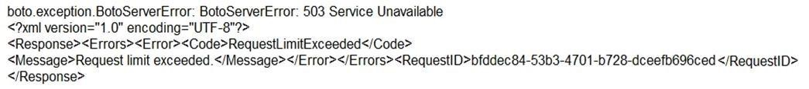
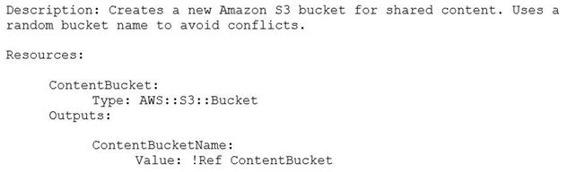

### Practice Exam 3
##### lines: 1443 - 1893

1. An application stores images in an S3 bucket. Amazon S3 event notifications are used to trigger a Lambda function that resizes the images. Processing each image takes less than a second. How will AWS Lambda handle the additional traffic?
    - Lambda will scale out to execute the requests concurrently.
    - Lambda will handle the requests sequentially in the order received.
    - Lambda will process multiple images in a single execution.
    - Lambda will add more compute to each execution to reduce processing time.

    

Answer

      Correct answer: A
    

2. A company is building a stock trading application that requires sub-millisecond latency in processing trading requests. Amazon DynamoDB is used to store all the trading data that is used to process each request. After load testing the application, the development team found that due to data retrieval times, the latency requirement is not satisfied. Because of sudden high spikes in the number of requests, DynamoDB read capacity has to be significantly over-provisioned to avoid throttling. What steps should be taken to meet latency requirements and reduce the cost of running the application?
    - Add Global Secondary Indexes for trading data.
    - Store trading data in Amazon S3 and use Transfer Acceleration.
    - Add retries with exponential back-off for DynamoDB queries.
    - Use DynamoDB Accelerator to cache trading data.

    

Answer

      Correct answer: A
    

3. A Developer created a Lambda function for a web application backend. When testing the Lambda function from the AWS Lambda console, the Developer can see that the function is being executed, but there is no log data being generated in Amazon CloudWatch Logs, even after several minutes. What could cause this situation?
    - The Lambda function does not have any explicit log statements for the log data to send it to CloudWatch Logs.
    - The Lambda function is missing CloudWatch Logs as a source trigger to send log data.
    - The execution role for the Lambda function is missing permissions to write log data to the CloudWatch Logs.
    - The Lambda function is missing a target CloudWatch Log group.

    

Answer

      Correct answer: C
    

4. A Developer wants to use AWS X-Ray to trace a user request end-to-end throughput the software stack. The Developer made the necessary changes in the application tested it, and found that the application is able to send the traces to AWS X-Ray. However, when the application is deployed to an EC2 instance, the traces are not available. Which of the following could create this situation? (Choose TWO)
    - The traces are reaching X-Ray, but the Developer does not have access to view the records.
    - The X-Ray daemon is not installed on the EC2 instance.
    - The X-Ray endpoint specified in the application configuration is incorrect.
    - The instance role does not have 'xray:BatchGetTraces' and 'xray:GetTraceGraph' permissions.The instance role does not have 'xray:PutTraceSegments' and 'xray:PutTelemetryRecords' permissions.
    - The instance role does not have 'xray:PutTraceSegments' and 'xray:PutTelemetryRecords' permissions.

    

Answer

      Correct answer: B, E
    

5. An application has hundreds of users. Each user may use multiple devices to access the application. The Developer wants to assign unique identifiers to these users regardless of the device they use. Which of the following methods should be used to obtain unique identifiers?
    - Create a user table in Amazon DynamoDB as key-value pairs of users and their devices. Use these keys as unique identifiers.
    - Use IAM-generated access key IDs for the users as the unique identifier, but do not store secret keys.
    - Implement developer-authenticated identities by using Amazon Cognito, and get credentials for these identities.
    - Assign IAM users and roles to the users. Use the unique IAM resource ID as the unique identifier.

    

Answer

      Correct answer: D
    

6. What are the steps to using the AWS CLI to launch a templatized serverless application?
    - Use AWS CloudFormation get-template then CloudFormation execute-change-set.
    - Use AWS CloudFormation validate-template then CloudFormation create-change-set.
    - Use AWS CloudFormation package then CloudFormation deploy.
    - Use AWS CloudFormation create-stack then CloudFormation update-stack.

    

Answer

      Correct answer: C  
      Read the tutorial. There is no mention of using execute-change-set or create-change-set.
      https://docs.aws.amazon.com/serverless-application-model/latest/developerguide/serverless-getting-started-hello-world.html#serverless-getting-started-hello-world-init
    

7. A deployment package uses the AWS CLI to copy files into any S3 bucket in the account, using access keys stored in environment variables. The package is running on EC2 instances, and the instances have been modified to run with an assumed IAM role and a more restrictive policy that allows access to only one bucket. After the change, the Developer logs into the host and still has the ability to write into all of the S3 buckets in that account. What is the MOST likely cause of this situation?
    - An IAM inline policy is being used on the IAM role.
    - An IAM managed policy is being used on the IAM role.
    - The AWS CLI is corrupt and needs to be reinstalled.
    - The AWS credential provider looks for instance profile credentials last.

    

Answer

      Correct answer: B  
      Inline policy is a policy created for a single IAM identity (a user, user group, or role).
      Customer managed policies are standalone policies that you can attach to principal entities (users, user groups, and roles).
      AWS managed policy is a standalone policy that is created and administered by AWS.
    

8. An application overwrites an object in Amazon S3, and then immediately reads the same object. Why would the application sometimes retrieve the old version of the object?
    - S3 overwrite PUTS are eventually consistent, so the application may read the old object.
    - The application needs to add extra metadata to label the latest version when uploading to Amazon S3.
    - All S3 PUTS are eventually consistent, so the application may read the old object.
    - The application needs to explicitly specify latest version when retrieving the object.

    

Answer

      Correct answer: A  
      S3 provides read-after-write consistency for PUTS of new objects.
      S3 provides eventual consistency for overwrite PUTS and DELETES.
      https://stackoverflow.com/questions/41448441/how-does-aws-s3-handle-overwriting-a-file-and-access

      You can update, retrieve any version of an object.
      https://docs.aws.amazon.com/AmazonS3/latest/API/API_PutObject.html 
    

9. An application under development is required to store hundreds of video files. The data must be encrypted within the application prior to storage, with a unique key for each video file. How should the Developer code the application?
    - Use the KMS Encrypt API to encrypt the data. Store the encrypted data key and data.
    - Use a cryptography library to generate an encryption key for the application. Use the encryption key to encrypt the data. Store the encrypted data.
    - Use the KMS GenerateDataKey API to get a data key. Encrypt the data with the data key. Store the encrypted data key and data.
    - Upload the data to an S3 bucket using server side-encryption with an AWS KMS key.

    

Answer

      Correct answer: C    
      Encrypt API plaintext of up to 4,096 bytes using a KMS key.  
      When a user calls kms:GenerateDataKey, KMS generates a data key, encrypts it with the CMK and finally returns plaintext and encrypted data key pair back.  
      SSE-S3 managed keys encrypts each object with a unique key. This is not the case for SSE-KMS.
    

10. A developer is testing an application that invokes an AWS Lambda function asynchronously. During the testing phase, the Lambda function fails to process after two retries. How can the developer troubleshoot the failure?
    - Configure AWS CloudTrail logging to investigate the invocation failures.
    - Configure Dead Letter Queues by sending events to Amazon SQS for investigation.
    - Configure Amazon Simple Workflow Service to process any direct unprocessed events.
    - Configure AWS Config to process any direct unprocessed events.

    

Answer

      Correct answer: B  
      Dead Letter Queues (DLQ) to capture and retain events that couldn't be processed successfully after a specified number of retries.
    

11. A developer is setting up Amazon API Gateway for their company's products. The API will be used by registered developers to query and update their environments. The company wants to limit the amount of requests end users can send for both cost and security reasons. Management wants to offer registered developers the option of buying larger packages that allow for more requests. How can the developer accomplish this with the LEAST amount of overhead management?
    - Enable throttling for the API Gateway stage. Set a value for both the rate and burst capacity. If a registered user chooses a larger package, create a stage for them, adjust the values, and share the new URL with them.
    - Set up Amazon CloudWatch API logging in API Gateway. Create a filter based on the user and requestTime fields and create an alarm on this filter. Write an AWS Lambda function to analyze the values and requester information, and respond accordingly. Set up the function as the target for the alarm. If a registered user chooses a larger package, update the Lambda code with the values.
    - Enable Amazon CloudWatch metrics for the API Gateway stage. Set up CloudWatch alarms based off the Count metric and the ApiName, Method, Resource, and Stage dimensions to alerts when request rates pass the threshold. Set the alarm action to Deny. If a registered user chooses a larger package, create a user-specific alarm and adjust the values.
    - Set up a default usage plan, specify values for the rate and burst capacity, and associate it with a stage. If a registered user chooses a larger package, create a custom plan with the appropriate values and associate the plan with the user.

    

Answer

      Correct answer: D
    

12. A developer is refactoring a monolithic application. The application takes a POST request and performs several operations. Some of the operations are in parallel while others run sequentially. These operations have been refactored into individual AWS Lambda functions. The POST request will be processed by Amazon API Gateway. How should the developer invoke the Lambda functions in the same sequence using API Gateway?
    - Use Amazon SQS to invoke the Lambda functions.
    - Use an AWS Step Functions activity to run the Lambda functions.
    - Use Amazon SNS to trigger the Lambda functions.
    - Use an AWS Step Functions state machine to orchestrate the Lambda functions.

    

Answer

      Correct answer: D  
      "...in the same sequence using API Gateway"
      AWS Step Function activities let you define a state machine task done by a worker, hosted in EC2, ECS.  
      An AWS Step Function state machine lets you run in same seq. 
    

13. A company is adding stored value (or gift card) capability to its highly popular casual gaming website. Users need to be able to trade this value for other users' items on the platform. This would require both users' records be updated as a single transaction, or both users' records to be completely rolled back. Which AWS database options can provide the transactional capability required for this new feature? (Choose TWO)
    - Amazon DynamoDB with operations made with the ConsistentRead parameter set to true.
    - Amazon ElastiCache for Memcached with operations made within a transaction block.
    - Amazon Aurora MySQL with operations made within a transaction block.
    - Amazon DynamoDB with reads and writes made using Transact* operations.
    - Amazon Redshift with operations made within a transaction block.

    

Answer

      Correct answer: C, D  
      Amazon DynamoDB ConsistentRead will only grant strongly consistent reads. 
      ElastiCache Redis can provide operations within a transaction block.

      DynamoDB Transact* operations
      https://docs.aws.amazon.com/amazondynamodb/latest/developerguide/transaction-apis.html
    

14. A developer is creating an AWS Lambda function that generates a new file each time it runs. Each new file must be checked into an AWS CodeCommit repository hosted in the same AWS account. How should the developer accomplish this?
    - When the Lambda function starts, use the Git CLI to clone the repository. Check the new file into the cloned repository and push the change.
    - After the new file is created in Lambda, use cURL to invoke the CodeCommit API. Send the file to the repository.
    - Use an AWS SDK to instantiate a CodeCommit client. Invoke the put_file method to add the file to the repository.
    - Upload the new to an Amazon S3 bucket. Create an AWS Step Function to accept S3 events. In the Step Function, add the new file to the repository.

    

Answer

      Correct answer: C  
      PutFile must be called, therefore C is correct. To do A approach, first Git CLI needs to be installed in Lambda runtime.
    

15. A developer must ensure that the IAM credentials used by an application in Amazon EC2 are not misused or compromised. What should the developer use to keep user credentials secure?
    - Environment variables.
    - AWS credentials file.
    - Instance profile credentials.
    - Command line options.

    

Answer

      Correct answer: D  
      Effectively use either AWS CLI, SDKs and tools or APIs.
      https://docs.aws.amazon.com/IAM/latest/UserGuide/security-creds.html
    

16. A company has an application where reading objects from Amazon S3 is based on the type of user. The user types are registered user and guest user. The company has 25,000 users and is growing. Information is pulled from an S3 bucket depending on the user type. Which approaches are recommended to provide access to both user types? (Choose TWO)
    - Provide a different access key and secret access key in the application code for registered users and guest users to provide read access to the objects.
    - Use S3 bucket policies to restrict read access to specific IAM users.
    - Use Amazon Cognito to provide access using authenticated and unauthenticated roles.
    - Create a new IAM user for each user and grant read access.
    - Use the AWS IAM service and let the application assume the different roles using the AWS Security Token Service (AWS STS) AssumeRole action depending on the type of user and provide read access to Amazon S3 using the assumed role.

    

Answer

      Correct answer: C, E  
      A: Never hard code keys.
      C: Need to distinguish between authenticated and unauthenticated users. 
      E: Can use STS to assume a particular role to grant whatever operation to S3. 
    

17. A company has 25,000 employees and is growing. The company is creating an application that will be accessible to its employees only. A developer is using Amazon S3 to store images and Amazon RDS to store application data. The company requires that all employee information remain in the legacy Security Assertion Markup Language (SAML) employee directory only and is not interested in mirroring any employee information on AWS. How can the developer provide authorized access for the employees who will be using this application so each employee can access their own application data only?
    - Use Amazon VPC and keep all resources inside the VPC, and use a VPC link for the S3 bucket with the bucket policy.
    - Use Amazon Cognito user pools, federate with the SAML provider, and use user pool groups with an IAM policy.
    - Use an Amazon Cognito identity pool, federate with the SAML provider, and use an IAM condition key with a value for the cognito-identity.amazonaws.com:sub variable to grant access to the employees.
    - Create a unique IAM role for each employee and have each employee assume the role to access the application so they can access their personal data only.

    

Answer

      Correct answer: C  

      Amazon Cognito user pool are for authentication.  
      Amazon Cognito identity pool are for authorization.  
      https://repost.aws/knowledge-center/cognito-user-pools-identity-pools
      https://docs.aws.amazon.com/IAM/latest/UserGuide/reference_policies_iam-condition-keys.html
    

18. A company has developed a new serverless application using AWS Lambda functions that will be deployed using the AWS Serverless Application Model (AWS SAM) CLI. Which step should the developer complete prior to deploying the application?
    - Compress the application to a .zip file and upload it into AWS Lambda.
    - Test the new AWS Lambda function by first tracing it in AWS X-Ray.
    - Bundle the serverless application using a SAM package.
    - Create the application environment using the eb create my-env command.

    

Answer

      Correct answer: C  
      https://docs.aws.amazon.com/codedeploy/latest/userguide/tutorial-lambda-sam-deploy-update.html
    

19. An application needs to encrypt data that is written to Amazon S3 where the keys are managed in an on-premises data center, and the encryption is handled by S3. Which type of encryption should be used?
    - Use server-side encryption with Amazon S3-managed keys.
    - Use server-side encryption with AWS KMS-managed keys.
    - Use client-side encryption with customer master keys.
    - Use server-side encryption with customer-provided keys.

    

Answer

      Correct answer: D  

      With Server-Side Encryption with Customer-Provided Keys (SSE-C), you manage the encryption keys and Amazon S3 manages the encryption, as it writes to disks, and decryption, when you access your objects. 
      https://docs.aws.amazon.com/AmazonS3/latest/userguide/serv-side-encryption.html
    

20. A development team is working on a mobile app that allows users to upload pictures to Amazon S3. The team expects the app will be used by hundreds of thousands of users during a single event simultaneously. Once the pictures are uploaded, the backend service will scan and parse the pictures for inappropriate content. Which approach is the MOST resilient way to achieve this goal, which also smooths out temporary volume spikes for the backend service?
    - Develop an AWS Lambda function to check the upload folder in the S3 bucket. If new uploaded pictures are detected, the Lambda function will scan and parse them.
    - Once a picture is uploaded to Amazon S3, publish the event to an Amazon SQS queue. Use the queue as an event source to trigger an AWS Lambda function. In the Lambda function, scan and parse the picture.
    - When the user uploads a picture, invoke an API hosted in Amazon API Gateway. The API will invoke an AWS Lambda function to scan and parse the picture.
    - Create a state machine in AWS Step Functions to check the upload folder in the S3 bucket. If a new picture is detected, invoke an AWS Lambda function to scan and parse it.

    

Answer

      Correct answer: B  

      A: Too many users uploading 
      B: Amazon S3 event notification to publish event to SQS queue handles volume spikes. This lets backend handle large number of incoming events in parallell by using event-driven architecture.
      C: I dont think this will do well with spikes in traffic. 
    

21. A development team wants to run their container workloads on Amazon ECS. Each application container needs to share data with another container to collect logs and metrics. What should the developer team do to meet these requirements?
    - Create two pod specifications. Make one to include the application container and the other to include the other container. Link the two pods together.
    - Create two task definitions. Make one to include the application container and the other to include the other container. Mount a shared volume between the two tasks.
    - Create one task definition. Specify both containers in the definition. Mount a shared volume between those two containers.
    - Create a single pod specification. Include both containers in the specification. Mount a persistent volume to both containers.

    

Answer

      Correct answer: C  
      https://stackoverflow.com/questions/55929954/how-to-share-file-or-directory-with-other-container-on-ecs/55929955#55929955

    

22. An ecommerce startup is preparing for an annual sales event. As the traffic to the company's application increases, the development team wants to be notified when the Amazon EC2 instance's CPU utilization exceeds 80%. Which solution will meet this requirement?
    - Create a custom Amazon CloudWatch alarm that sends a notification to an Amazon SNS topic when the CPU utilization exceeds 80%.
    - Create a custom AWS Cloud Trail alarm that sends a notification to an Amazon SNS topic when the CPU utilization exceeds 80%.
    - Create a cron job on the EC2 instance that executes the –describe-instance-information command on the host instance every 15 minutes and sends the results to an Amazon SNS topic.
    - Create an AWS Lambda function that queries the AWS CloudTrail logs for the CPUUtilization metric every 15 minutes and sends a notification to an Amazon SNS topic when the CPU utilization exceeds 80%.

    

Answer

      Correct answer: A  
      CPU utilisation is available on CloudWatch not CloudTrail. 
    

23. An application running on Amazon EC2 opens connections to an Amazon RDS SQL Server database. The developer does not want to store the user name and password for the database in the code. The developer would also like to automatically rotate the credentials. What is the MOST secure way to store and access the database credentials?
    - Create an IAM role that has permissions to access the database. Attach the role to the EC2 instance.
    - Use AWS Secrets Manager to store the credentials. Retrieve the credentials from Secrets Manager as needed.
    - Store the credentials in an encrypted text file in an Amazon S3 bucket. Configure the EC2 instance's user data to download the credentials from Amazon S3 as the instance boots.
    - Store the user name and password credentials directly in the source code. No further action is needed because the source code is stored in a private repository.

    

Answer

      Correct answer: B  

      A: MS SQL is not supported for IAM (only MySQL and PostgreSQL)
      B: Question asks about storing user name and password with rotation. Secrets Manager is way to go.
      C: How do you rotate?
      D: Never store credentials in source code
    

24. A developer is updating an application deployed on AWS Elastic Beanstalk. The new version is incompatible with the old version. To successfully deploy the update, a full cutover to the new, updated version must be performed on all instances at one time, with the ability to roll back changes in case of a deployment failure in the new version. How can this be performed with the LEAST amount of downtime?
    - Use the Elastic Beanstalk All at once deployment policy to update all instances simultaneously.
    - Perform an Elastic Beanstalk Rolling with additional batch deployment.
    - Deploy the new version in a new Elastic Beanstalk environment and swap environment URLs.
    - Perform an Elastic Beanstalk Rolling deployment.

    

Answer

      Correct answer: C  

      A: Out of service for a short time
      B: I don't believe there is roll back
      C: Supports rollback and avoids downtime. 
      D: Each batch is taken out of service during deployment phase.
    

25. A developer is writing a web application that must share secure documents with end users. The documents are stored in a private Amazon S3 bucket. The application must allow only authenticated users to download specific documents when requested, and only for a duration of 15 minutes. How can the developer meet these requirements?
    - Copy the documents to a separate S3 bucket that has a lifecycle policy for deletion after 15 minutes.
    - Create a presigned S3 URL using the AWS SDK with an expiration time of 15 minutes.
    - Use server-side encryption with AWS KMS managed keys (SSE-KMS) and download the documents using HTTPS.
    - Modify the S3 bucket policy to only allow specific users to download the documents. Revert the change after 15 minutes.

    

Answer

      Correct answer: B  

      A: This method doesn't seem feasible according to first line in link below.  
      B: Designed for time-limited access to objects in Amazon S3 w/o updating bucket policy  
      C: What about time limit?  
      D: Labour intensive - having to delete exactly at 15 mins  

      https://docs.aws.amazon.com/AmazonS3/latest/userguide/using-presigned-url.html#:~:text=When%20you%20create%20a%20presigned%20URL%2C%20you%20must,for%20%20uploading%29%204%20An%20expiration%20time%20interval
    

26. A company is developing a report executed by AWS Step Functions, Amazon CloudWatch shows errors in the Step Functions task state machine. To troubleshoot each task, the state input needs to be included along with the error message in the state output. Which coding practice can preserve both the original input and the error for the state?
    - Use ResultPath in a Catch statement to include the error with the original input.
    - Use InputPath in a Catch statement and set the value to null.
    - Use Error Equals in a Retry statement to include the error with the original input.
    - Use OutputPath in a Retry statement and set the value to $.

    

Answer

      Correct answer: A  

      A: Use ResultPath in a Catch to include the error with the original input, instead of replacing it.  
      B: InputPath is for limiting the input that is passed  
      C: What about the original input?   
      D: OutputPath enables you to select a portion of state output to pass to next state  

      https://docs.aws.amazon.com/step-functions/latest/dg/input-output-resultpath.html#input-output-resultpath-catch

    

27. A developer receives the following error message when trying to launch or terminate an Amazon EC2 instance using a boto3 script. What should the developer do to correct this error message?

    - Assign an IAM role to the EC2 instance to allow necessary API calls on behalf of the client.
    - Implement an exponential backoff algorithm for optimizing the number of API requests made to Amazon EC2.
    - Increase the overall network bandwidth to handle higher API request rates.
    - Upgrade to the latest AWS CLI version so that boto3 can handle higher request rates.

    

Answer

      Correct answer: B
    

28. Given the following AWS CloudFormation template. What is the MOST efficient way to reference the new Amazon S3 bucket from another AWS CloudFormation template?

    - Add an Export declaration to the Outputs section of the original template and use ImportValue in other templates.
    - Add Exported: true to the Contentbucket in the original template and use ImportResource in other templates.
    - Create a custom AWS CloudFormation resource that gets the bucket name from the ContentBucket resource of the first stack.
    - Use Fn::Include to include the existing template in other templates and use the ContentBucket resource directly.

    

Answer

      Correct answer: A  

      A: "To reference an exported output value in a stack's template, use the export name and the Fn::ImportValue function."
      B: Exported is the past participle of Export. This isn't consistent with other fields.  
      C: May work, doesn't seem efficient though.  
      D: Lets you create a reference to a template snippet in an Amazon S3 bucket  

      https://docs.aws.amazon.com/AWSCloudFormation/latest/UserGuide/using-cfn-stack-exports.html
    

29. A developer is using AWS CodeDeploy to deploy an application running on Amazon EC2. The developer wants to change the file permissions for a specific deployment file. Which lifecycle event should a developer use to meet this requirement?
    - AfterInstall.
    - DownloadBundle.
    - BeforeInstall.
    - ValidateService.

    

Answer

      Correct answer: A  

      A: configure your app or change file permissions  
      B: agent copies revision files to a temp location on instance  
      C: use for preinstall tasks such as decrypting files and creating a backup of current version  
      D: verify deployment completed successfully  
      https://aws.amazon.com/codedeploy/faqs/
    

30. A developer is using Amazon DynamoDB to store application data. The developer wants to further improve application performance by reducing response times for read and write operations. Which DynamoDB feature should be used to meet these requirements?
    - Amazon DynamoDB Streams.
    - Amazon DynamoDB Accelerator.
    - Amazon DynamoDB global tables.
    - Amazon DynamoDB transactions.

    

Answer

      Correct answer: B  

      A: Collects a sequence of item-level changes ordered by time  
      B: DAX offers fast in-memory performance for demanding applications  
      C: fully managed, serverless, multi-region and multi-active db  
      D: group multiple actions together and send them as all-or-nothing operations  

      https://docs.aws.amazon.com/amazondynamodb/latest/developerguide/DAX.html
    

31. A developer is creating a script to automate the deployment process for a serverless application. The developer wants to use an existing AWS Serverless Application Model (AWS SAM) template for the application. What should the developer use for the project? (Choose TWO)
    - Call aws cloudformation package to create the deployment package. Call aws cloudformation deploy to deploy the package afterward.
    - Call sam package to create the deployment package. Call sam deploy to deploy the package afterward.
    - Call aws s3 cp to upload the AWS SAM template to Amazon S3. Call aws lambda update-function-code to create the application.
    - Create a ZIP package locally and call aws serverlessrepo create-application to create the application.
    - Create a ZIP package and upload it to Amazon S3. Call aws cloudformation create-stack to create the application.

    

Answer

      Correct answer: A, B  

      A, B: Use SAM client to build app in local and create standard template. When the template is ready, package (creates a CloudFormation template in S3 w resource) and then deploy it (run all configs in CloudFormation and create cloud resources).  
      "The sam package command is an alias for the aws cloudformation package AWS CLI command."  
      C, D, E: These don't involve automation  
      D: Doesn't deploy a SAM app  

      https://docs.aws.amazon.com/serverless-application-model/latest/developerguide/sam-specification.html
    

32. A development team is designing a mobile app that requires multi-factor authentication. Which steps should be taken to achieve this? (Choose TWO)
    - Use Amazon Cognito to create a user pool and create users in the user pool.
    - Send multi-factor authentication text codes to users with the Amazon SNS Publish API call in the app code.
    - Enable multi-factor authentication for the Amazon Cognito user pool.
    - Use AWS IAM to create IAM users.
    - Enable multi-factor authentication for the users created in AWS IAM.

    

Answer

      Correct answer: A, C  

      A: Amazon Cognito provides easy set up for sign-up and sign-in functionality to your apps  
      https://docs.aws.amazon.com/cognito/
    

33. Two containerized microservices are hosted on Amazon EC2 ECS. The first microservice reads an Amazon RDS Aurora database instance, and the second microservice reads an Amazon DynamoDB table. How can each microservice be granted the minimum privileges?
    - Set ECS_ENABLE_TASK_IAM_ROLE to false on EC2 instance boot in ECS agent configuration file. Run the first microservice with an IAM role for ECS tasks with read-only access for the Aurora database. Run the second microservice with an IAM role for ECS tasks with read-only access to DynamoDB.
    - Set ECS_ENABLE_TASK_IAM_ROLE to false on EC2 instance boot in the ECS agent configuration file. Grant the instance profile role read-only access to the Aurora database and DynamoDB.
    - Set ECS_ENABLE_TASK_IAM_ROLE to true on EC2 instance boot in the ECS agent configuration file. Run the first microservice with an IAM role for ECS tasks with read-only access for the Aurora database. Run the secondmicroservice with an IAM role for ECS tasks with read-only access to DynamoDB.
    - Set ECS_ENABLE_TASK_IAM_ROLE to true on EC2 instance boot in the ECS agent configuration file. Grant the instance profile role read-only access to the Aurora database and DynamoDB.

    

Answer

      Correct answer: C

      C: We need ECS_ENABLE_TASK_IAM_ROLE for user roles in the containers. Then read-access must be granted to Aurora and DynamoDB

      https://docs.aws.amazon.com/AmazonECS/latest/developerguide/task-iam-roles.html
    

34. A developer has written an AWS Lambda function using Java as the runtime environment. The developer wants to isolate a performance bottleneck in the code. Which steps should be taken to reveal the bottleneck?
    - Use the Amazon CloudWatch API to write timestamps to a custom CloudWatch metric. Use the CloudWatch console to analyze the resulting data.
    - Use the AWS X-Ray API to write trace data into X-Ray from strategic places within the code. Use the Amazon CloudWatch console to analyze the resulting data.
    - Use the AWS X-Ray API to write trace data into X-Ray from strategic places within the code. Use the X-Ray console to analyze the resulting data.
    - Use the Amazon CloudWatch API to write timestamps to a custom CloudWatch metric. Use the AWS X-Ray console to analyze the resulting data.

    

Answer

      Correct answer: C  

      B: You don't use CloudWatch to analyze the resulting data.
    

35. A developer added a new feature to an application running on an Amazon EC2 instance that uses Amazon SQS. After deployment, the developer noticed a significant increase in Amazon SQS costs. When monitoring the Amazon SQS metrics on Amazon CloudWatch, the developer found that on average one message per minute is posted on this queue. What can be done to reduce Amazon SQS costs for this application?
    - Increase the Amazon SQS queue polling timeout.
    - Scale down the Amazon SQS queue to the appropriate size for low traffic demand.
    - Configure push delivery via Amazon SNS instead of polling the Amazon SQS queue.
    - Use an Amazon SQS first-in, first-out (FIFO) queue instead of a standard queue.

    

Answer

      Correct answer: A

      A: Long polling helps to reduce the cost of Amazon SQS by eliminating number of empty responses  
      B, C: Won't reduce costs
      D: Queues should be same cost

      https://repost.aws/knowledge-center/sqs-high-charges
      https://blog.awsfundamentals.com/sqs-pricing
      https://docs.aws.amazon.com/AWSSimpleQueueService/latest/SQSDeveloperGuide/best-practices-setting-up-long-polling.html#:~:text=The%20maximum%20long%20polling%20wait%20time%20is%2020,are%20available%20but%20aren%27t%20included%20in%20a%20response%29.
    

36. A developer is building an application using an Amazon API Gateway REST API backend by an AWS Lambda function that interacts with an Amazon DynamoDB table. During testing, the developer observes high latency when making requests to the API. How can the developer evaluate the end-to-end latency and identify performance bottlenecks?
    - Enable AWS CloudTrail logging and use the logs to map each latency and bottleneck.
    - Enable and configure AWS X-Ray tracing on API Gateway and the Lambda function. Use X-Ray to trace and analyze user requests.
    - Enable Amazon CloudWatch Logs for the Lambda function. Enable execution logs for API Gateway to view and analyze user request logs.
    - Enable VPC Flow Logs to capture and analyze network traffic within the VPC.

    

Answer

      Correct answer: B  

      B: Use trace map to identify bottlenecks, latency spikes and other issues to improve the performance of your applications  

      https://docs.aws.amazon.com/xray/latest/devguide/aws-xray.html
    

37. An IAM role is attached to an Amazon EC2 instance that explicitly denies access to all Amazon S3 API actions. The EC2 instance credentials file specifies the IAM access key and secret access key, which allow full administrative access. Given that multiple modes of IAM access are present for this EC2 instance, which of the following is correct?
    - The EC2 instance will only be able to list the S3 buckets.
    - The EC2 instance will only be able to list the contents of one S3 bucket at a time.
    - The EC2 instance will be able to perform all actions on any S3 bucket.
    - The EC2 instance will not be able to perform any S3 action on any S3 bucket.

    

Answer

      Correct answer: D  

      D: Explicit deny policies in IAM take precedence over any allow policies.  
      https://docs.aws.amazon.com/IAM/latest/UserGuide/reference_policies_evaluation-logic.html
    

38. A development team uses AWS Elastic Beanstalk for application deployment. The team has configured the application version lifecycle policy to limit the number of application versions to 25. However, even with the lifecycle policy, the source bundle is deleted from the Amazon S3 source bucket. What should a developer do in the Elastic Beanstalk application version lifecycle settings to retain the source code in the S3 bucket?
    - Change the Set the application versions limit by total count setting to zero.
    - Disable the Lifecycle policy setting.
    - Change the Set the application version limit by age setting to zero.
    - Set Retention to Retain source bundle in S3.

    

Answer

      Correct answer: D  

      A, C: Will just speed up deletion  
      B: If you don't delete versions that you no longer use, you will eventually reach application version quota and be unable to make new versions of an app.  
      D: You can retain the source bundle from S3 when app is deleted  
      https://docs.aws.amazon.com/elasticbeanstalk/latest/dg/applications-lifecycle.html
    

39. A developer has built a market application that stores pricing data in Amazon DynamoDB with Amazon ElastiCache in front. The prices of items in the market change frequently. Sellers have begun complaining that, after they update the price of an item, the price does not actually change in the product listing. What could be causing this issue?
    - The cache is not being invalidated when the price of the item is changed.
    - The price of the item is being retrieved using a write-through ElastiCache cluster.
    - The DynamoDB table was provisioned with insufficient read capacity.
    - The DynamoDB table was provisioned with insufficient write capacity.

    

Answer

      Correct answer: A  

      A: Cache is not being invalidated when the price of the item is changed. Instead, we should use a write through cache policy in order to invalidate the cache as soon as an item has been added or modified to the table.   
      B: You should see immediate change with write-through
    

40. A developer is provided with an HTTPS clone URL for an AWS CodeCommit repository. What needs to be configured before cloning this repository?
    - Use AWS KMS to set up public and private keys for use with AWS CodeCommit.
    - Set up the Git credential helper to use an AWS credential profile, and enable the helper to send the path to the repositories.
    - Use AWS Certificate Manager to provision public and private SSL/TLS certificates.
    - Generate encryption keys using AWS CloudHSM, then export the key for use with AWS CodeCommit.

    

Answer

      Correct answer: B  

      A, C, D: No mention in below resource  
      B: For HTTPS using Git credentials or the credential helper included with AWS CLI.
      https://docs.aws.amazon.com/codecommit/latest/userguide/how-to-connect.html
    

41. What is required to trace Lambda-based applications with AWS X-Ray?
    - Send logs from the Lambda application to an S3 bucket; trigger a Lambda function from the bucket to send data to AWS X-Ray.
    - Trigger a Lambda function from the application logs in Amazon CloudWatch to submit tracing data to AWS X-Ray.
    - Use an IAM execution role to give the Lambda function permissions and enable tracing.
    - Update and add AWS X-Ray daemon code to relevant parts of the Lambda function to set up the trace.

    

Answer

      Correct answer: C  

      C: Your function needs permission to upload trace data to X-Ray  
      https://docs.aws.amazon.com/lambda/latest/dg/services-xray.html#:~:text=Your%20function%20needs%20permission%20to,all%20requests%20to%20your%20application.
    

42. A development team is building a new application that will run on Amazon EC2 and use Amazon DynamoDB as a storage layer. The developers all have assigned IAM user accounts in the same IAM group. The developers currently can launch EC2 instances, and they need to be able to launch EC2 instances with an instance role allowing access to Amazon DynamoDB. Which AWS IAM changes are needed when creating an instance role to provide this functionality?
    - Create an IAM permission policy attached to the role that allows access to DynamoDB. Add a trust policy to the role that allows DynamoDB to assume the role. Attach a permissions policy to the development group in AWS IAM that allows developers to use the iam:GetRole and iam:PassRole permissions for the role.
    - Create an IAM permissions policy attached to the role that allows access to DynamoDB. Add a trust policy to the role that allows Amazon EC2 to assume the role. Attach a permissions policy to the development group in AWS IAM that allows developers to use the iam:PassRole permission for the role.
    - Create an IAM permission policy attached to the role that allows access to Amazon EC2. Add a trust policy to the role that allows DynamoDB to assume the role. Attach a permissions policy to the development group in AWS IAM that allows developers to use the iam:PassRole permission for the role.
    - Create an IAM permissions policy attached to the role that allows access to DynamoDB. Add a trust policy to the role that allows Amazon EC2 to assume the role. Attach a permissions policy to the development group in AWS IAM that allows developers to use the iam:GetRole permission for the role.

    

Answer

      Correct answer: B  
      Question wants you to launch EC2 instances with an instance role allowing access to DynamoDB  

      B: Policy attached to a role for EC2 instance profile. The policy will give role access to DynamoDB and allow developers to pass that role into EC2 during launch.
      C: If you don't have the iam:PassRole permission for specific role, you can't assign that role to resources.  
      D: PassRole is needed not GetRole  
      https://docs.aws.amazon.com/IAM/latest/UserGuide/id_roles_use_passrole.html
    

43. A developer converted an existing program to an AWS Lambda function in the console. The program runs properly on a local laptop, but shows an 'Unable to import module' error when tested in the Lambda console. Which of the following can fix the error?
    - Install the missing module and specify the current directory as the target. Create a ZIP file to include all files under the current directory, and upload the ZIP file.
    - Install the missing module in a lib directory. Create a ZIP file to include all files under the lib directory, and upload the ZIP file as dependency file.
    - In the Lambda code, invoke a Linux command to install the missing modules under the /usr/lib directory.
    - In the Lambda console, create a LB_LIBRARY_PATH environment and specify the value for the system library plan.

    

Answer

      Correct answer: A (I think it's B)  

      A: curr directory is not usually mentioned in docs... hmm
      B: lib is mentioned in docs  
      D: Should be LD_LIBRARY PATH  

      Resources below advocate for installing missing module in some directory.  
      https://docs.aws.amazon.com/lambda/latest/dg/packaging-layers.html  
      https://repost.aws/knowledge-center/lambda-import-module-error-python  
      https://stackoverflow.com/questions/72485427/how-to-add-custom-libraries-and-binaries-in-aws-lambda
    

44. A front-end web application is using Amazon Cognito user pools to handle the user authentication flow. A developer is integrating Amazon DynamoDB into the application using the AWS SDK for JavaScript. How would the developer securely call the API without exposing the access or secret keys?
    - Configure Amazon Cognito identity pools and exchange the JSON Web Token (JWT) for temporary credentials.
    - Run the web application in an Amazon EC2 instance with the instance profile configured.
    - Hardcore the credentials, use Amazon S3 to host the web application, and enable server-side encryption.
    - Use Amazon Cognito user pool JSON Web Tokens (JWITs) to access the DynamoDB APIs.

    

Answer

      Correct answer: A  

      A: Identity pools provide AWS credentials to grant your users access to other AWS services. 
      B: The application is "front-end" so it is static. Therefore, S3 is used because it is cheaper.  
      D: User pools cannot access AWS resources, you need user pools and identity pools to do so. Also, JWT are best as temporary credentials.

      https://docs.aws.amazon.com/cognito/latest/developerguide/amazon-cognito-integrating-user-pools-with-identity-pools.html  
      https://docs.aws.amazon.com/cognito/latest/developerguide/cognito-scenarios.html
    

45. A developer needs to manage AWS infrastructure as code and must be able to deploy multiple identical copies of the infrastructure, stage changes, and revert to previous versions. Which approach addresses these requirements?
    - Use cost allocation reports and AWS OpsWorks to deploy and manage the infrastructure.
    - Use Amazon CloudWatch metrics and alerts along with resource tagging to deploy and manage the infrastructure.
    - Use AWS Elastic Beanstalk and AWS CodeCommit to deploy and manage the infrastructure.
    - Use AWS CloudFormation and AWS CodeCommit to deploy and manage the infrastructure.

    

Answer

      Correct answer: D  

      Question mentions IaC and being able to deploy multiple identical copies, therefore it is D.
    

46. A Developer needs to deploy an application running on AWS Fargate using Amazon ECS. The application has environment variables that must be passed to a container for the application to initialize. How should the environment variables be passed to the container?
    - Define an array that includes the environment variables under the environment parameter within the service definition.
    - Define an array that includes the environment variables under the environment parameter within the task definition.
    - Define an array that includes the environment variables under the entryPoint parameter within the task definition.
    - Define an array that includes the environment variables under the entryPoint parameter within the service definition.

    

Answer

      Correct answer: B  

      https://docs.aws.amazon.com/AmazonECS/latest/developerguide/taskdef-envfiles.html  
    

47. A company's fleet of Amazon EC2 instances receives data from millions of users through an API. The servers batch the data, add an object for each user, and upload the objects to an S3 bucket to ensure high access rates. The object attributes are Customer ID, Server ID, TS-Server (TimeStamp and Server ID), the size of the object, and a timestamp. A Developer wants to find all the objects for a given user collected during a specified time range. After creating an S3 object created event, how can the Developer achieve this requirement?
    - Execute an AWS Lambda function in response to the S3 object creation events that creates an Amazon DynamoDB record for every object with the Customer ID as the partition key and the Server ID as the sort key. Retrieve all the records using the Customer ID and Server ID attributes.
    - Execute an AWS Lambda function in response to the S3 object creation events that creates an Amazon Redshift record for every object with the Customer ID as the partition key and TS-Server as the sort key. Retrieve all the records using the Customer ID and TS-Server attributes.
    - Execute an AWS Lambda function in response to the S3 object creation events that creates an Amazon DynamoDB record for every object with the Customer ID as the partition key and TS-Server as the sort key. Retrieve all the records using the Customer ID and TS-Server attributes.
    - Execute an AWS Lambda function in response to the S3 object creation events that creates an Amazon Redshift record for every object with the Customer ID as the partition key and the Server ID as the sort key. Retrieve all the records using the Customer ID and Server ID attributes.

    

Answer

      Correct answer: C  

        

      A: Object attribute is already in TS-Server form, so use this
      B, D: DynamoDB better suited to work with date and timestamp data  
      https://aws.amazon.com/blogs/database/working-with-date-and-timestamp-data-types-in-amazon-dynamodb/
    

48. A company is managing a NoSQL database on-premises to host a critical component of an application, which is starting to have scaling issues. The company wants to migrate the application to Amazon DynamoDB with the following considerations: Optimize frequent queries. Reduce read latencies. Plan for frequent queries on certain key attributes of the table. Which solution would help achieve these objectives?
    - Create global secondary indexes on keys that are frequently queried. Add the necessary attributes into the indexes.
    - Create local secondary indexes on keys that are frequently queried. DynamoDB will fetch needed attributes from the table.
    - Create DynamoDB global tables to speed up query responses. Use a scan to fetch data from the table.
    - Create an AWS Auto Scaling policy for the DynamoDB table.

    

Answer

      Correct answer: A   

      Global secondary index - Index w/ partition key and sort key that can be different from that of base table. It's global because queries on index can search all of data in base table, across all partitions.  

      Local secondary index - Index w/ same parittion key as base table, but different sort key. It's local because every partition of local secondary index is scoped to base table partition with same partition key value.  

      B: When you query local secondary index for attributes not projected, DynamoDB must read read entire item from table. This may introduce latency + avoidable I/O operations  
      C: Will not necessarily reduce read latencies. A scan may result in slow query responses.  
      https://docs.aws.amazon.com/amazondynamodb/latest/developerguide/bp-indexes-general.html
    

49. A developer is writing an application that will process data delivered into an Amazon S3 bucket. The data is delivered approximately 10 times a day, and the developer expects the data will be processed in less than 1 minute, on average. How can the developer deploy and invoke the application with the lowest cost and lowest latency?
    - Deploy the application as an AWS Lambda function and invoke it with an Amazon CloudWatch alarm triggered by an S3 object upload.
    - Deploy the application as an AWS Lambda function and invoke it with an S3 event notification.
    - Deploy the application as an AWS Lambda function and invoke it with an Amazon CloudWatch scheduled event.
    - Deploy the application onto an Amazon EC2 instance and have it poll the S3 bucket for new objects.

    

Answer

      Correct answer: B  

      Simplest to just do in S3 event notifications while achieving low latency  
      https://aws.amazon.com/blogs/aws/s3-event-notification/  
      https://docs.aws.amazon.com/AmazonS3/latest/userguide/enable-event-notifications.html
    

50. A company is using Amazon API Gateway to manage its public-facing API. The CISO requires that the APIs be used by test account users only. What is the MOST secure way to restrict API access to users of this particular AWS account?
    - Client-side SSL certificates for authentication.
    - API Gateway resource policies.
    - Cross-origin resource sharing (CORS).
    - Usage plans.

    

Answer

      Correct answer: B  
      https://docs.aws.amazon.com/apigateway/latest/developerguide/welcome.html
      
    

